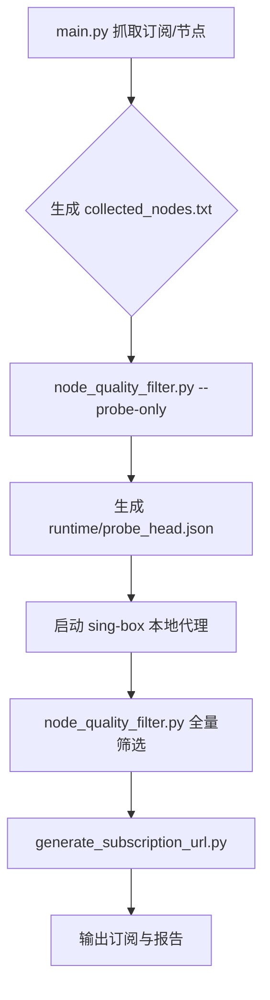

# SmartSub - 全能代理订阅聚合与质量筛选工具

🚀 **基于 GitHub Actions 的自动化抓取、去重与节点质量监测系统**

SmartSub 旨在为您提供最纯净、稳定的代理体验。它能自动遍历 Telegram 频道、GitHub 仓库及各类网页，智能捕获并聚合订阅链接。内置先进的**节点质量过滤器**，自动剔除高风险 IP、高延迟节点及重复内容，实时生成适配 **Clash**、**Loon**、**Quantumult X** 及 **Sub-Store** 的标准化订阅文件。

[](https://github.com/features/actions)
[](https://www.python.org/)
[](LICENSE)

---

## ✨ 核心特性

### 🌐 全方位抓取
- ✅ **多源采集**：自动聚合 Telegram 频道、GitHub 仓库、直连 URL 及网页模糊抓取
- ✅ **智能提取**：深度解析页面内容，自动识别 `vmess://`, `ss://`, `trojan://`, `vless://`, `hysteria2://` 等协议
- ✅ **去重机制**：基于 MD5 和节点参数的智能去重，消除重复订阅
- ✅ **GitHub 用户去重**：同一 GitHub 用户的多个订阅链接仅保留一个，减少噪音
- ✅ **安全防护**：内置 SSRF 防护机制，防止恶意请求内网地址

### 🎯 深度质量控制 (NEW!)
- ✅ **智能评分系统**：首创节点评分机制，根据协议类型（Hysteria2/VLESS 优先）、地区（CN/RU 降分）、IP 风险值动态评分
- ✅ **高级风控过滤**：
  - **钓鱼防护**：自动识别高风险 TLD (.tk, .xyz 等) 和钓鱼关键词
  - **IP 纯净度检测**：集成 IP-API/AbuseIPDB，识别机房 IP、高风险 IP 和滥用 IP
  - **ASN/ISP 阻断**：支持按运营商或 ASN 阻断特定网络
- ✅ **连接性测试**：多维度检测（连通性、延迟、下载速度），确保节点可用性
- ✅ **动态探测头**：从当次抓取节点中盲选最快节点作为临时跳板，模拟更真实链路
- ✅ **区域策略**：支持白名单（优选地区）和黑名单（屏蔽地区）策略

### 🛡️ 自动清理与维护
- ✅ **失效订阅自动删除**：识别 404/502 等错误状态码，自动清理失效链接
- ✅ **资源熔断保护**：
  - **流式下载限制**：单文件最大 3MB，防止内存溢出
  - **文件大小控制**：自动截断过大的节点库和日志文件
- ✅ **自动重试机制**：网络波动时自动重试，提高采集成功率

### ⚡ 高性能架构
- ✅ **极速并发**：内置 32 线程池，秒级处理成百上千个订阅源
- ✅ **智能采样**：针对超大规模节点库（5000+），采用智能采样算法，兼顾速度与质量
- ✅ **五协议支持**：仅保留 vmess, ss, trojan, vless, hysteria2

### ⚙️ 自动化部署
- ✅ **GitHub Actions 集成**：7×24 小时无人值守自动更新
- ✅ **完全配置化**：所有参数可在 `config.yaml` 灵活调整
- ✅ **安全依赖**：已升级到最新版本，修复所有已知安全漏洞

---

## 🚀 快速开始

### 1. 克隆项目

```bash
git clone https://github.com/yourusername/SmartSub.git
cd SmartSub
```

### 2. 安装依赖

```bash
pip install -r requirements.txt
```

**依赖管理说明**:
- `requirements.txt`: 使用 `>=` 允许小版本更新，获取安全补丁
- `requirements-lock.txt`: 锁定当前测试通过的稳定版本，适合生产环境

如需使用锁定版本：
```bash
pip install -r requirements-lock.txt
```

### 3. 自检配置（可选）

```bash
python scripts/self_check.py
```

用于快速检查配置合法性、协议范围与订阅源重复项。

### 4. 运行程序

```bash
python main.py
```

首次运行将自动：
- 抓取订阅源
- 验证订阅质量
- 过滤失效和低质量订阅
- 生成聚合文件

---

## 🧭 流程图



## ⚙️ 配置说明

编辑 `config.yaml` 自定义抓取源和质量控制参数：

### 基础配置

```yaml
# Telegram 频道列表
tgchannel:
  - https://t.me/example_channel
  - https://t.me/another_channel

# 直连订阅源（GitHub 或其他稳定 URL）
subscribe:
  - https://raw.githubusercontent.com/user/repo/main/sub.yaml

# 网页模糊抓取（博客、论坛、任何网页）
web_pages:
  - https://example.com/free-vpn-list
```

### 性能配置

```yaml
performance:
  max_workers: 32              # 并发线程数（根据机器调整）
  content_limit_mb: 3          # 下载限制（MB）
  request_timeout: 6           # 请求超时（秒）
```

### 订阅采集质量控制 (Subscription Quality Control)

```yaml
quality_control:
  min_nodes: 3                 # 单个订阅最少节点数（少于此数将被过滤）
  enable_duplicate_check: true # 启用订阅内容去重（防止重复采集）
  enable_quality_check: true   # 启用基础质量检查
```

### 节点质量筛选与风控配置 (Node Quality Filter)

```yaml
quality_filter:
  max_workers: 32              # 并发测试线程数
  connect_timeout: 5           # 连接超时时间(秒)
  max_latency: 500             # 最大可接受延迟(ms)
  min_speed: 0                 # 最小下载速度(KB/s)

  # 智能采样与输出控制
  max_test_nodes: 5000         # 最大测试节点数
  max_output_nodes: 150        # 最终输出精选节点数
  smart_sampling: true         # 启用智能采样算法

  # 区域策略 (Geo-IP)
  region_limit:
    enabled: true
    policy: score              # score: 降分模式 (推荐) / filter: 阻断模式
    allowed_countries: [US, KR, TW, JP, SG, HK] # 优选地区 (加分)
    blocked_countries: [CN, IR, RU, KP]         # 风险地区 (降分/阻断)

# 风险与钓鱼防护 (Risk Control)
risk_filter:
  enabled: true
  mode: score                # score: 降分 / filter: 丢弃
  penalty: 6                 # 基础扣分
  suspicious_tlds: [tk, xyz, top, icu, cyou] # 高风险域名后缀
  phishing_keywords: [login, bank, verify]   # 钓鱼关键词

# IP 纯净度检测 (IP Risk Check)
ip_risk_check:
  enabled: true
  provider: ipapi            # ipapi (免费) 或 abuseipdb (需 Key)
  ipapi_behavior:
    exclude_hosting: true    # 机房 IP 降分 (保留但降低优先级)
    exclude_proxy: false     # 允许代理 IP
```

### 订阅转换后端配置

```yaml
subconverter_backends:
  - api.dler.io
  - sub.xeton.dev
  - sub.id9.cc
  - sub.maoxiongnet.com
```

### 通知配置 (可选)

支持多种通知方式，通过环境变量配置：

### 4. 配置 GITHUB_TOKEN / GIST_TOKEN (必选)

为了生成 **GitHub Gist 订阅链接**（推荐，最稳定私密），你需要配置 Token：

1. **创建 Token**:
   - 访问 [GitHub Settings > Tokens](https://github.com/settings/tokens/new)
   - Note: `SmartSub`
   - Scopes: **仅勾选 `gist`**
   - 点击 Generate token 并复制

2. **配置 Secrets**:
   - 在仓库 Settings -> Secrets -> Actions -> New repository secret
   - Name: `GIST_TOKEN`
   - Value: (刚才复制的 Token)

3. **(推荐) 配置 GIST_ID 实现永久订阅**:
   - 如果你想让订阅链接**永远不变**：
     1. 手动创建一个 Gist (或运行一次脚本生成)
     2. 获取 Gist ID (URL 中最后那串字符)
     3. 添加 Secret Name: `GIST_ID`, Value: (你的 Gist ID)

#### Telegram Bot 通知（可选，推荐）

1. 在 Telegram 搜索 `@BotFather` 创建 Bot
2. 获取 Bot Token 和 Chat ID
3. GitHub 仓库设置 Secrets：
   - `TELEGRAM_BOT_TOKEN`: Bot Token
   - `TELEGRAM_CHAT_ID`: Chat ID

#### Discord Webhook

1. Discord 频道设置 → Webhook → 复制 URL
2. 设置 Secret: `DISCORD_WEBHOOK_URL`

#### Server酱（微信推送）

1. 访问 https://sct.ftqq.com/ 获取 SendKey
2. 设置 Secret: `SERVERCHAN_KEY`

#### PushPlus（微信推送）

1. 访问 http://www.pushplus.plus/ 获取 Token
2. 设置 Secret: `PUSHPLUS_TOKEN`

配置后会在每次运行完成时收到通知！

---

## 📊 运行效果示例

程序运行后会自动输出统计报告：

```
============================================================
📊 订阅抓取统计报告
============================================================
✅ 有效订阅: 45 个
   - Clash 订阅: 28 个
   - V2Ray 订阅: 15 个
   - 机场订阅: 2 个

🔍 质量控制统计:
   - 检查总数: 120 个
   - 重复内容: 25 个
   - 低质量订阅: 30 个
     • 空订阅: 10 个
     • 节点过少: 15 个
     • 垃圾内容: 5 个

❌ 失效订阅: 20 个

💡 质量提升: 过滤了 75 个无效/低质订阅 (62.5%)
============================================================
```

---

## 📂 输出文件

以下文件为运行时生成，默认建议不提交到 GitHub（已在 `.gitignore` 中忽略）：

### 根目录文件
| 文件 | 说明 |
|------|------|
| `sub_merge.txt` | **推荐** 通用聚合订阅（明文），包含所有链接和节点 |
| `sub_merge_base64.txt` | **推荐** 通用聚合订阅（Base64），可直接作为订阅链接使用 |
| `collected_nodes.txt` | 抓取到的所有直连/裸节点（实时更新，限制 10k 条） |
| `failed_subscriptions.log` | 失效订阅记录（可审查/恢复） |

### `sub/` 目录文件
| 文件 | 说明 |
|------|------|
| `sub_all.yaml` | 所有有效订阅的聚合文件（总库） |
| `sub_all_clash.txt` | **Clash订阅文件（Base64编码，可直接导入）** ✅ |
| `sub_all_loon.txt` | **Loon订阅文件（Base64编码，可直接导入）** ✅ |
| `sub_all_sub_store.txt` | Sub-Store 专用格式（区分机场与开心玩耍） |
| `YYYY/MM/D-DD.yaml` | 按日期归档的每日抓取结果 |
| `sub/high_quality_nodes.txt` | ⭐ **高质量筛选节点**（经过连通性、延迟、IP风险检测） |
| `runtime/quality_report.json` | 节点质量分析报告（包含统计数据） |

### 节点格式规范

高质量节点输出（`sub/high_quality_nodes.txt`）采用标准化命名格式：

```
{国旗Emoji} {国家代码} 🛡️{风险值} ⚡{综合得分} {协议名}
```

**示例**：
```
🇺🇸 US 🛡️0 ⚡98 Vmess
🇯🇵 JP 🛡️0 ⚡95 Vless
🇸🇬 SG 🛡️15 ⚡85 Trojan
🇩🇪 DE 🛡️N/A ⚡72 Hysteria2
```

**字段说明**：
- **国旗Emoji**: 节点所在国家/地区的旗帜
- **国家代码**: ISO 3166-1 alpha-2 标准代码（US, JP, SG等）
- **🛡️风险值**: IP风险评分（0=纯净IP，100=高风险，N/A=未检测）
  - `0`: 家庭宽带IP，最佳质量
  - `1-50`: 低风险
  - `50+`: 高风险（可能被限制）
  - `N/A`: 未启用IP检测
- **⚡综合得分**: 基于协议、延迟、风险值的综合评分（0-100+）
  - 协议加分：Hysteria2(10) > Vless(9) > Trojan(8) > Vmess(7) > SS(6)
  - 延迟加分：<100ms(+5), 100-200ms(+3), 200-300ms(+1)
  - IP纯净度加分：风险值0(+10)
- **协议名**: 节点协议类型（Vmess, Vless, Trojan, SS, Hysteria2等）

> **注意**: `collected_nodes.txt` 中的节点为原始格式（未重命名），仅 `high_quality_nodes.txt` 采用上述标准化格式。

---

## 🤖 GitHub Actions 自动化

本项目完全支持 GitHub Actions，实现自动化抓取：

### 工作流说明

工作流文件位于 `.github/workflows/fetch.yml`，主要步骤：

1. **定时触发**: 每天北京时间凌晨 4 点自动运行
2. **手动触发**: 可在 Actions 页面手动运行
3. **执行流程**:
   - 抓取订阅源 (`main.py`)
   - 盲选探测头 (`node_quality_filter.py --probe-only`)
   - 生成并启动 sing-box 本地代理（用于真实链路检测）
   - 筛选高质量节点 (`node_quality_filter.py`)
   - 生成订阅 URL (`generate_subscription_url.py`)
   - 推送到 Telegram（如已配置）
   - 提交更新到仓库

### ✅ 发布前检查

```bash
python scripts/self_check.py
```

建议在提交/发布前运行，确保配置无明显问题、协议范围一致。

### 🧹 订阅源清理

```bash
python scripts/clean_sources.py
```

依据最近一次运行生成的 `runtime/source_health.json`，自动移除 404 与低质量来源，并做去重。

### 首次部署

1. Fork 本仓库
2. 配置必需的 Secrets (Settings → Secrets → Actions):
   - `GIST_TOKEN`: GitHub Personal Access Token (需 `gist` 权限)
   - `GIST_ID`: Gist ID (可选，用于固定订阅链接)
3. 手动触发一次工作流验证配置
4. 完成！之后将自动运行

---

## 📝 更新日志

### v2.0 (2026-01)
- ✅ 修复 GitHub Actions 推送冲突问题
- ✅ 添加自动订阅 URL 生成
- ✅ 增强节点 URL 正则表达式
- ✅ 添加日志文件自动轮转
- ✅ 优化工作流程

### v1.0
- 🎯 智能质量控制系统
- 🔄 自动失效订阅清理
- 📊 详细统计报告
- 🔒 安全依赖升级
- ⚡ 性能优化和配置化
- 🛡️ 内存保护与文件自动维护

---

## 📚 相关文档

- **[配置参数详解](docs/CONFIGURATION.md)** - 详细说明所有配置参数的作用、影响和最佳实践
- **[故障排查指南](docs/TROUBLESHOOTING.md)** - 常见问题诊断和解决方案
- **[节点来源说明](NODES_SOURCE.md)** - 各个文件的来源和用途说明

---

## 🤝 贡献

欢迎提交 Issue 和 Pull Request！

在提交 Issue 时，请提供：
- 详细的错误日志
- 运行环境（操作系统、Python 版本）
- 相关配置文件（脱敏后）
